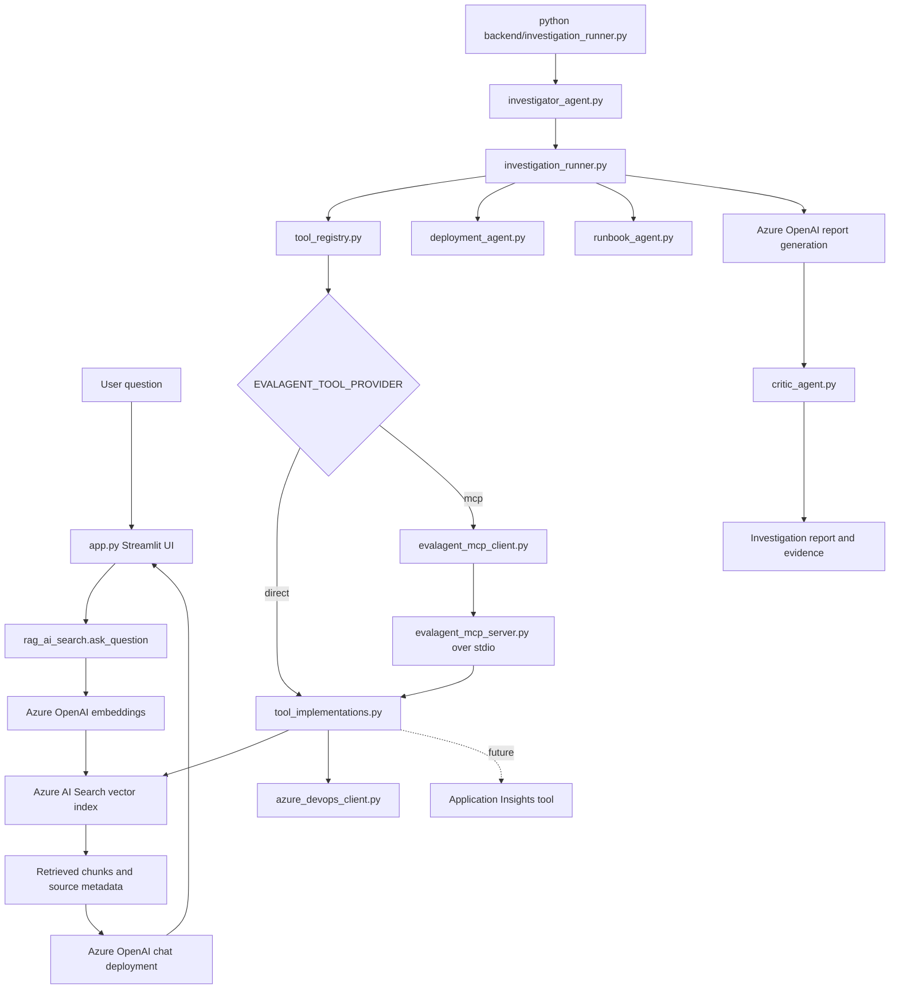
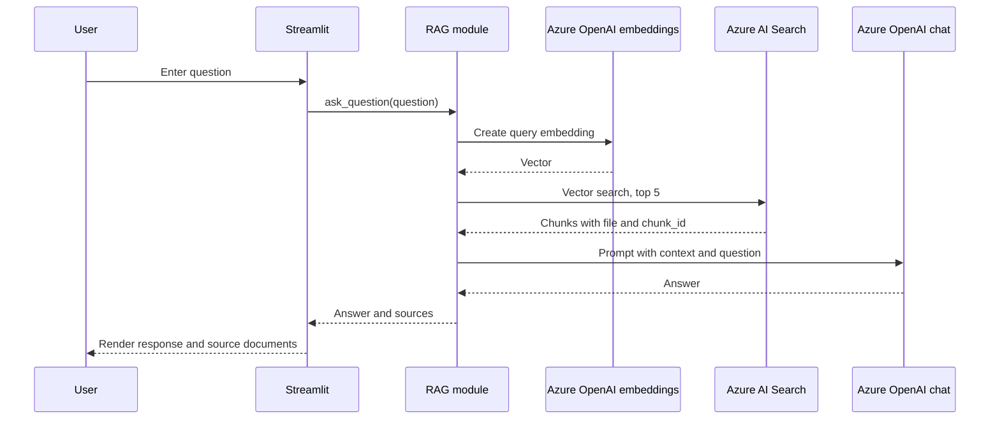

# Architecture and Coding Guide

## Purpose

This document is a handoff for another LLM that will help maintain and improve the `evalagent` repository.

The project is an incident investigation assistant. It answers questions about incidents, deployments, architecture, engineering investigations, and runbooks using Markdown evidence, Azure OpenAI, Azure AI Search, and optional Azure DevOps data.

The most important design rule is evidence grounding: the assistant must use retrieved evidence, identify missing information, and avoid inventing causes, timelines, remediation, or operational facts.

## High-Level Architecture



There are currently two paths:

1. **Active browser path:** `app.py` -> `rag_ai_search.py` -> `search_ai_search.py` -> Azure AI Search/Azure OpenAI.
2. **Richer investigation path:** `investigation_runner.py` -> planner, `ToolRegistry`, direct or MCP tools, specialized agents, report writer, and critic.

The richer path supports a temporary provider switch:

- `EVALAGENT_TOOL_PROVIDER=direct` (default): `ToolRegistry` calls `tool_implementations.py` directly.
- `EVALAGENT_TOOL_PROVIDER=mcp`: `ToolRegistry` calls `evalagent_mcp_client.py`, which launches the local stdio MCP server.

The investigation runner still decides which tools to call. MCP provides the tool boundary; it does not enable autonomous LLM tool selection.

The browser path does not currently call `run_investigation`. A fix must first establish which path the requested behavior belongs to.

## Repository Layout

### Application entry point

#### `app.py`

The Streamlit application:

- Configures the page and session state.
- Displays prior user and assistant messages.
- Accepts a question through `st.chat_input`.
- Calls `backend.rag_ai_search.ask_question(question)`.
- Displays the returned answer and source chunks.
- Looks up the complete local Markdown file under `data/` for source expanders.

`app.py` should remain a presentation layer. Retrieval, prompting, parsing, and Azure calls belong in backend modules.

### Active retrieval and RAG

#### `backend/rag_ai_search.py`

Provides `ask_question(question)`:

1. Reads Azure Search configuration.
2. Creates a query embedding using `AZURE_OPENAI_EMBEDDING_DEPLOYMENT`.
3. Sends the embedding to Azure AI Search through `VectorizedQuery`.
4. Uses the top five chunks as context.
5. Sends the context and question to `AZURE_OPENAI_CHAT_DEPLOYMENT`.
6. Returns `(answer_text, sources)`.

The source shape is:

```python
{
    "file": "data/incidents/incident-1042.md",
    "chunk_id": 0,
    "content": "retrieved Markdown text"
}
```

When changing this function, preserve the tuple return contract unless all callers are updated.

#### `backend/search_ai_search.py`

Contains the lower-level retrieval functions:

- `search_chunks(query)`: semantic vector search, returning up to five chunks.
- `search_document(file_name)`: retrieves all chunks for one document and sorts by `chunk_id`.

Both functions validate these settings before using Azure AI Search:

- `AZURE_SEARCH_ENDPOINT`
- `AZURE_SEARCH_KEY`
- `AZURE_SEARCH_INDEX`

`search_document` currently scans all indexed documents and filters by basename in Python. This is correct enough for the current small corpus but inefficient. A future improvement can add a filterable file query, but it must preserve ordering and the returned source shape.

### Index creation and ingestion

#### `backend/ingest_ai_search.py`

This is a destructive rebuild script:

1. Reads every `data/**/*.md` file.
2. Normalizes literal `\\n` sequences.
3. Splits documents into 500-character chunks with 100-character overlap.
4. Creates an embedding for every chunk.
5. Deletes the configured Azure AI Search index if it exists.
6. Creates fields for `id`, `file`, `chunk_id`, `content`, and `embedding`.
7. Configures an HNSW vector profile.
8. Uploads documents in batches of 1,000.

The indexed document shape is:

```python
{
    "id": "incident-1042-0",
    "file": "data/incidents/incident-1042.md",
    "chunk_id": 0,
    "content": "...",
    "embedding": [...]
}
```

Run this only when the target index and credentials are correct because it deletes and recreates the index.

### Multi-agent investigation workflow

#### `backend/investigator_agent.py`

Creates an investigation plan using the GPT-5-mini deployment. The planner must return JSON with:

- `investigation_type`
- `incident_id`
- `deployment_id`
- `runbook_reference`
- `search_incident`
- `search_deployment`
- `search_runbooks`

The function is `create_investigation_plan(question)`.

#### `backend/investigation_runner.py`

This is the main orchestrator for the richer workflow.

Its `run_investigation(question)` function:

1. Creates a plan.
2. Retrieves an incident exactly when an incident ID is known; otherwise it uses semantic search.
3. Extracts deployment and runbook references from evidence.
4. Retrieves deployment and runbook documents.
5. Selects primary evidence and limits supporting evidence.
6. Analyzes deployment evidence.
7. Analyzes runbook evidence.
8. Extracts Azure DevOps work item, pull request, and repository markers.
9. Retrieves matching Azure DevOps data when the CLI opt-in is enabled and valid references exist.
10. Generates a structured report with Azure OpenAI.
11. Reviews the report with the critic agent.
12. Returns `(report_text, evidence)`.

Important evidence behavior:

- An explicitly requested incident should remain primary evidence.
- An explicitly requested deployment can become primary when there is no incident ID.
- Supporting evidence is limited to three distinct documents.
- Evidence is deduplicated by file and chunk ID before formatting.

The module also contains pure helper functions for filename normalization, reference extraction, deduplication, evidence formatting, and report formatting. These are good candidates for unit tests because they do not need live Azure services.

#### `backend/deployment_agent.py`

`analyze_deployment(deployment_file, deployment_content)` sends only deployment evidence to Azure OpenAI and expects JSON containing:

- `deployment`
- `change_summary`
- `risks`
- `related_incidents`
- `rollback_status`
- `risk_rating`

`risk_rating` must be exactly `Low`, `Medium`, or `High`.

#### `backend/runbook_agent.py`

`analyze_runbook(runbook_file, runbook_content)` sends only runbook evidence to Azure OpenAI and expects JSON containing:

- `runbook`
- `purpose`
- `immediate_actions`
- `escalation_conditions`
- `recovery_steps`
- `risk_level`

`risk_level` must be exactly `Low`, `Medium`, or `High`.

If the model does not provide a purpose, the module derives one from Markdown headings and content using `_purpose_from_runbook`.

#### `backend/critic_agent.py`

`review_report(report_text, evidence)` checks the generated report against supplied evidence. It returns:

- `confidence`: `Low`, `Medium`, or `High`
- `report_quality`: `Weak`, `Fair`, or `Strong`
- `evidence_coverage`: `Weak`, `Partial`, or `Strong`
- `missing_evidence`
- `unsupported_claims`
- `recommended_next_steps`
- `review_summary`

The critic must never use outside knowledge.

### Tool dispatch, MCP, and Azure DevOps

#### `backend/tool_registry.py`

`ToolRegistry` is a compatibility facade used by `investigation_runner.py`. It preserves the existing public method names while selecting either the direct provider or the MCP provider.

#### `backend/tool_implementations.py`

Contains the lower-level implementations shared by both providers:

- Azure AI Search incident, deployment, and runbook retrieval.
- Azure DevOps work item, pull request, and release retrieval.
- Evidence category/source metadata decoration.

The MCP server imports this module directly. It must not import `ToolRegistry`, because that would create a circular call through the MCP client.

#### `backend/evalagent_mcp_client.py`

Provides synchronous wrappers around the MCP 2.x client and stdio transport. It launches `backend.evalagent_mcp_server` as a local Python subprocess, initializes a session, and calls one named tool. It also provides a safe tool-listing command:

```powershell
python -m backend.evalagent_mcp_client
```

The current implementation starts a server subprocess per tool call. This is acceptable for local development and a portfolio project; a persistent session is a future performance improvement.

#### `backend/evalagent_mcp_server.py`

Exposes these MCP tools:

- `get_incident`
- `get_deployment`
- `get_runbook`
- `get_work_item`
- `get_pull_request`
- `get_release`

Each MCP tool delegates to `tool_implementations.py`. The server does not call the MCP-backed registry.

#### Planned Application Insights tool

Application Insights is the next planned investigation integration. It should be added as another MCP tool and lower-level implementation, for example a narrowly scoped query tool for retrieving relevant telemetry or traces. Keep it opt-in, evidence-shaped, mockable, and separate from report generation. Do not treat Application Insights as available evidence until the tool returns actual records during the current investigation.

Document methods:

- `get_incident(incident_id)`
- `get_deployment(deployment_id)`
- `get_runbook(runbook_name)`

External-system methods:

- `get_work_item(work_item_id)`
- `get_pull_request(repository_id, pr_id)`
- `get_release(release_id)`

Search results are decorated with:

```python
{
    "source": "azure_ai_search",
    "category": "incident|deployment|runbook",
    "primary": False,
    "file": "...",
    "chunk_id": 0,
    "content": "..."
}
```

Preserve these metadata fields because the investigation runner uses `category` and `primary` when choosing and formatting evidence.

#### `backend/azure_devops_client.py`

A small REST client using `urllib.request` and Azure DevOps API version `7.1`.

It uses:

- `AZDO_ORG`
- `AZDO_PROJECT`
- `AZDO_PAT`

It provides normalized dictionaries for work items, pull requests, and releases. It cleans HTML from work item descriptions and wraps HTTP/network errors in `AzureDevOpsError`.

Do not log the PAT or full authorization header. Tests should mock `_request_json` rather than call Azure DevOps.

### Legacy FAISS path

These files are older and are not used by the current Streamlit application:

- `backend/ingest.py`
- `backend/rag.py`
- `backend/search.py`
- `vector_index.faiss`
- `documents.pkl`

They use local FAISS indexes and pickle data. Azure AI Search is the current implementation. Do not update both paths for a normal bug fix unless the task explicitly requires backward compatibility or migration.

### Standalone smoke-test module

#### `backend/model.py`

This is a standalone Azure OpenAI smoke test. It creates a client and sends `what is 1+1?` at module execution time. It is not imported by the application workflow. Avoid importing it from production code because it has side effects.

## Data Flow in More Detail

### Simple RAG request



### Investigation request

The richer workflow is evidence expansion rather than one search call:

```text
Question
  -> investigation plan
  -> primary incident or semantic incident retrieval
  -> linked deployment retrieval
  -> linked runbook retrieval
  -> deployment analysis
  -> runbook analysis
    -> Azure DevOps enrichment through direct or MCP provider
    -> future Application Insights enrichment when implemented
  -> report generation
  -> evidence critic
  -> final report plus evidence
```

## Configuration

The application expects a local `.env` file. Never include its values in a prompt, commit, log, or generated documentation.

```text
AZURE_OPENAI_ENDPOINT
AZURE_OPENAI_API_KEY
AZURE_OPENAI_CHAT_DEPLOYMENT
AZURE_OPENAI_EMBEDDING_DEPLOYMENT
AZURE_OPENAI_GPT5_MINI_DEPLOYMENT
AZURE_SEARCH_ENDPOINT
AZURE_SEARCH_KEY
AZURE_SEARCH_INDEX
AZDO_ORG
AZDO_PROJECT
AZDO_PAT
EVALAGENT_TOOL_PROVIDER
```

The OpenAI client uses API version `2024-12-01-preview` throughout the current code.

## How to Diagnose and Fix a Problem

When asked to fix something, another LLM should follow this order:

1. Identify the user-visible symptom and the entry point.
2. Decide whether the issue is in the Streamlit RAG path or the multi-agent path.
3. Trace the smallest call chain to the code that computes or mutates the bad behavior.
4. Inspect the return shape and configuration required at that boundary.
5. Make the smallest focused edit consistent with the existing style.
6. Add or update a focused unit test for pure logic where possible.
7. Run the narrowest validation first.
8. Only then run a broader command or live Azure test.

Useful validation commands:

```powershell
python -m compileall app.py backend
python backend/investigation_runner.py
streamlit run app.py
python backend/ingest_ai_search.py
```

Do not run ingestion casually because it recreates the Azure Search index.

For Azure-dependent tests, mock:

- `AzureOpenAI`
- `SearchClient`
- `AzureKeyCredential`
- `azure_devops_client`

Pure helper functions in `investigation_runner.py`, `tool_registry.py`, and `runbook_agent.py` can be tested without network access.

## Common Fix Locations

- Wrong answer or missing citations in the browser: inspect `rag_ai_search.py`, `search_ai_search.py`, and the prompt context construction.
- No results from a known incident/deployment/runbook: inspect filename normalization in `tool_registry.py` and document matching in `search_document`.
- Wrong primary evidence: inspect selection and ordering in `investigation_runner.py`.
- Missing deployment or runbook sections: inspect specialized agent JSON prompts, normalization, and report formatting.
- Report makes unsupported claims: inspect evidence assembly, report prompt, and `critic_agent.py`.
- Azure DevOps enrichment fails: inspect marker regexes in `investigation_runner.py`, environment variables, and `azure_devops_client.py`.
- Indexing or vector dimension errors: inspect `ingest_ai_search.py`, embedding deployment configuration, and Azure Search index recreation.
- Import errors when running a module directly: preserve the existing relative-import/absolute-import fallback pattern unless standardizing execution intentionally.

## Tests and Validation

The repository has mocked unit coverage in `tests/test_investigation_runner.py` for the investigation workflow, deployment analyzer retry behavior, MCP client/server routing, provider switching, evidence contracts, deduplication, and secret-safe errors. Tests must not make live Azure calls.

Useful commands:

```powershell
python -m compileall backend
python -m unittest discover -s tests -v
pytest -q
python -m backend.evalagent_mcp_client
```

Do not run `backend/ingest_ai_search.py` during ordinary validation because it deletes and recreates the Azure AI Search index.

## Current Technical Debt

- `requirements.txt` is empty even though the project imports Streamlit, OpenAI, dotenv, Azure SDK packages, and legacy FAISS dependencies.
- The Streamlit UI has not been wired to the richer investigation workflow.
- Azure AI Search retrieval is vector-only and has no score threshold or hybrid text search.
- Exact document retrieval scans all documents and filters locally.
- LLM JSON responses use manual validation rather than a shared schema or retry mechanism.
- The MCP client starts a new local server subprocess for each tool call; a persistent session would reduce overhead.
- MCP mode currently routes Search and Azure DevOps tools through the same local MCP server; Application Insights is planned but not implemented.
- MCP transport is local stdio and does not yet provide remote authentication or authorization.
- Tool schemas use ordinary Python dictionaries rather than shared strict domain models.
- Azure DevOps still uses a PAT locally; production use would need managed identity or a dedicated secret broker.

## Instructions to the Next LLM

Before editing:

- Read the specific files involved in the symptom.
- State a falsifiable hypothesis about the failure.
- Identify the cheapest check that could disprove it.
- Do not change unrelated legacy FAISS code.

While editing:

- Keep Azure calls isolated and mockable.
- Keep MCP server tools dependent on lower-level implementations, never on `ToolRegistry`.
- Preserve `EVALAGENT_TOOL_PROVIDER=direct|mcp` until MCP parity is verified.
- For new integrations such as Application Insights, add the lower-level implementation, MCP tool, registry method, and mocked contract tests together.
- Preserve source metadata and public return contracts.
- Keep prompts explicit about evidence limitations.
- Do not expose credentials.
- Prefer a small, testable change over a broad refactor.

After editing:

- Run a focused validation immediately.
- Fix local failures before widening the scope.
- Report changed files, validation performed, and any remaining Azure/environment dependency.
