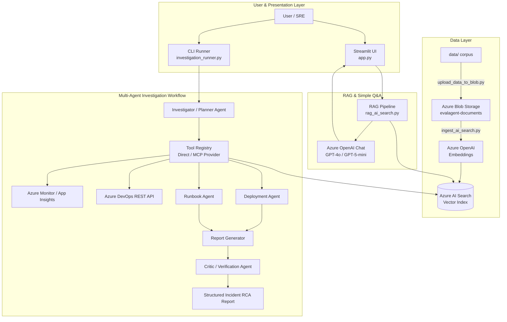

# EvalAgent: AI-Powered Incident Investigation & Triage Assistant

**EvalAgent** is an enterprise-grade, multi-agent incident investigation system designed for site reliability engineering (SRE) and DevOps teams. It automates root-cause analysis (RCA), correlates live production telemetry, links code deployments with Azure DevOps work items/pull requests, and synthesizes runbook guidance into actionable investigation reports using **Azure OpenAI**, **Azure AI Search**, **Azure Blob Storage**, and **Model Context Protocol (MCP)**.

---

## 🌟 Key Capabilities

- **🤖 Multi-Agent Orchestration**:
  - **Investigator / Planner Agent**: Generates structured investigation strategies and extracts incident/deployment identifiers.
  - **Deployment Agent**: Analyzes release notes, configuration changes, and blast radiuses from deployment manifests.
  - **Runbook Agent**: Evaluates operational procedures, risk levels, and mitigation steps.
  - **Critic / Reviewer Agent**: Validates investigation reports against primary evidence to prevent hallucinations and enforce factual grounding.
- **☁️ Cloud Document Corpus (Azure Blob Storage)**:
  - Centralized, cloud-backed storage for engineering documentation, incident postmortems, architecture guides, and service runbooks.
  - Integrated with Azure identity (`DefaultAzureCredential` / RBAC).
- **🔍 Vector Retrieval & Hybrid RAG (Azure AI Search)**:
  - Embeddings powered by Azure OpenAI (`text-embedding-3-small` / Ada) with HNSW vector indexing.
  - Chunks, indexes, and retrieves semantically relevant documentation with exact source citations.
- **📊 Real-Time Observability (Azure Monitor / Application Insights)**:
  - Executes dynamic KQL queries against Azure Monitor Logs across requests, dependencies, exceptions, and traces for correlated incident time windows.
- **🔄 DevOps & SCM Integration (Azure DevOps)**:
  - Automatically fetches linked Work Items, Pull Requests, and release pipelines associated with problematic deployments.
- **🔌 Model Context Protocol (MCP) Architecture**:
  - Modular tool provider enabling standardized tool invocation across local and distributed MCP servers.
- **💻 Interactive Streamlit UI**:
  - Full-featured web interface for interactive incident Q&A, source inspection, and document verification.

---

## 🏗️ Architecture



---

## 🛠️ Tech Stack

| Domain | Technology / Service |
| :--- | :--- |
| **Language & Frameworks** | Python 3.11+, Streamlit, Pydantic |
| **Generative AI & LLMs** | Azure OpenAI (GPT-4o, GPT-5-mini, text-embedding-3-small) |
| **Vector Search & Indexing** | Azure AI Search (HNSW Vector Profiles, Hybrid Search) |
| **Cloud Storage** | Azure Blob Storage (`azure-storage-blob`) |
| **Cloud Identity & Security** | Microsoft Entra ID (`DefaultAzureCredential` / RBAC) |
| **Observability & Telemetry** | Azure Monitor Logs / Application Insights (`azure-monitor-query`, KQL) |
| **DevOps & Issue Tracking** | Azure DevOps REST API (Work Items, Pull Requests, Releases) |
| **Agent Tool Protocol** | Model Context Protocol (MCP SDK) |
| **Testing & CI** | `unittest`, `unittest.mock` (Comprehensive offline mocked test suite) |

---

## 📂 Project Structure

```
evalagent/
├── app.py                            # Streamlit web UI & interactive chat
├── requirements.txt                  # Python dependencies
├── .env.example                      # Environment variables template
├── backend/
│   ├── blob_storage_client.py        # Azure Blob Storage client & document manager
│   ├── ingest_ai_search.py           # Corpus ingestion & Azure AI Search indexer
│   ├── search_ai_search.py           # Vector search & document retrieval module
│   ├── rag_ai_search.py              # End-to-end RAG question-answering pipeline
│   ├── investigation_runner.py       # Multi-agent investigation workflow coordinator
│   ├── investigator_agent.py         # Investigation planning & intent parsing agent
│   ├── deployment_agent.py           # Deployment risk & release analysis agent
│   ├── runbook_agent.py              # Operational runbook analysis agent
│   ├── critic_agent.py               # Factual review & grounding verification agent
│   ├── application_insights_client.py# Azure Monitor KQL query engine
│   ├── azure_devops_client.py        # Azure DevOps REST integration
│   ├── tool_registry.py              # Dispatcher for Direct vs. MCP tool providers
│   ├── tool_implementations.py       # Core tool execution logic
│   ├── evalagent_mcp_client.py       # MCP client interface
│   └── evalagent_mcp_server.py       # Standardized MCP stdio server
├── data/                             # Engineering documentation corpus
│   ├── architecture/                 # Service architecture diagrams and specs
│   ├── deployments/                  # Deployment release manifests
│   ├── engineering/                  # Historical RCA postmortems and deep-dives
│   ├── incidents/                    # Incident logs and timeline records
│   └── runbooks/                     # Operational runbooks and mitigation guides
├── scripts/
│   ├── upload_data_to_blob.py        # Sync local data/ corpus to Azure Blob Storage
│   └── generate_appinsights_telemetry.py # Synthetic telemetry generator for testing
└── tests/
    ├── test_application_insights.py  # Application Insights client tests
    ├── test_blob_storage.py          # Azure Blob Storage integration & mock tests
    └── test_investigation_runner.py  # Multi-agent workflow and tool tests
```

---

## 🚀 Getting Started

### Prerequisites

- **Python 3.10+**
- **Azure Subscription** with:
  - Azure OpenAI Service (Chat & Embedding models deployed)
  - Azure AI Search Service
  - Azure Storage Account with a Blob container (`evalagent-documents`)
  - *(Optional)* Azure Monitor / Log Analytics Workspace & Azure DevOps organization

### 1. Installation

Clone the repository and install the required dependencies:

```bash
git clone https://github.com/your-username/evalagent.git
cd evalagent
pip install -r requirements.txt
```

### 2. Configure Environment Variables

Create a `.env` file in the project root based on `.env.example`:

```env
# Azure OpenAI
AZURE_OPENAI_ENDPOINT=https://<your-openai-resource>.openai.azure.com/
AZURE_OPENAI_API_KEY=<your-api-key>
AZURE_OPENAI_CHAT_DEPLOYMENT=gpt-4o-mini
AZURE_OPENAI_EMBEDDING_DEPLOYMENT=text-embedding-3-small
AZURE_OPENAI_GPT5_MINI_DEPLOYMENT=gpt-5-mini

# Azure AI Search
AZURE_SEARCH_ENDPOINT=https://<your-search-service>.search.windows.net
AZURE_SEARCH_KEY=<your-search-admin-key>
AZURE_SEARCH_INDEX=incident-index

# Azure Blob Storage
AZURE_STORAGE_ACCOUNT_NAME=<your-storage-account-name>
AZURE_STORAGE_CONTAINER_NAME=evalagent-documents

# Optional: Azure DevOps & Telemetry
AZDO_ORG=<your-org>
AZDO_PROJECT=<your-project>
AZDO_PAT=<your-pat>
APPLICATIONINSIGHTS_WORKSPACE_ID=<your-workspace-id>
EVALAGENT_TOOL_PROVIDER=direct
```

Authenticate to Azure locally:

```bash
az login
```

---

## 📦 Data Ingestion & Azure Blob Storage Setup

EvalAgent uses **Azure Blob Storage** as the centralized, cloud-backed source for the incident and engineering corpus. Follow these steps to upload your documentation and index it into Azure AI Search:

### Step 1: Upload Corpus to Azure Blob Storage

The project includes an automated sync script ([scripts/upload_data_to_blob.py](scripts/upload_data_to_blob.py)) that discovers all Markdown files from your local corpus directory and uploads them to the private Azure Blob container (`evalagent-documents`), preserving folder hierarchy (such as `incidents/`, `deployments/`, `runbooks/`, `architecture/`, and `engineering/`):

1. **Authenticate to Azure** (uses `DefaultAzureCredential`):
   ```bash
   az login
   ```

2. **Run the Upload Script**:
   ```bash
   # Uploads files from the local data/ folder by default
   python scripts/upload_data_to_blob.py
   ```

   > **Custom Directory Support**: If your markdown corpus is in a backup or custom directory (e.g. `data_backup/`), you can pass the path or call the sync utility directly:
   > ```bash
   > python -c "from scripts.upload_data_to_blob import sync_local_data_to_blob; sync_local_data_to_blob('data_backup')"
   > ```

3. **Verify Uploaded Blobs in Azure**:
   ```bash
   az storage blob list --account-name <your-storage-account-name> --container-name evalagent-documents --auth-mode login --output table
   ```

### Step 2: Ingest from Blob Storage into Azure AI Search

Once the documents are stored in Azure Blob Storage, run the ingestion pipeline. It downloads the corpus directly from the Blob container in memory, creates chunk embeddings via Azure OpenAI, and builds/updates the Azure AI Search index:

```bash
python backend/ingest_ai_search.py
```

---

## 💡 Running the Application

### 1. Interactive Streamlit Web Interface

Launch the interactive RAG UI:

```bash
streamlit run app.py
```

### 2. Multi-Agent Investigation CLI

Run an autonomous end-to-end incident investigation with multi-agent planning and critic review:

```bash
python backend/investigation_runner.py
```

---

## 🧪 Testing

The repository includes a comprehensive, offline unit test suite that mocks Azure services and LLM responses:

```bash
python -m unittest discover tests
```

---

## 🛡️ Factual Grounding & Design Principles

1. **Strict Grounding**: The system explicitly identifies missing context rather than fabricating incident timelines, code changes, or mitigation steps.
2. **Zero-Secret Cloud Auth**: Leverages Azure Managed Identity / `DefaultAzureCredential` for secure access to Azure Blob Storage and Azure Monitor.
3. **Decoupled Architecture**: Separation of concerns between storage (Blob), retrieval (AI Search), orchestration (Runner/Agents), and presentation (Streamlit).
